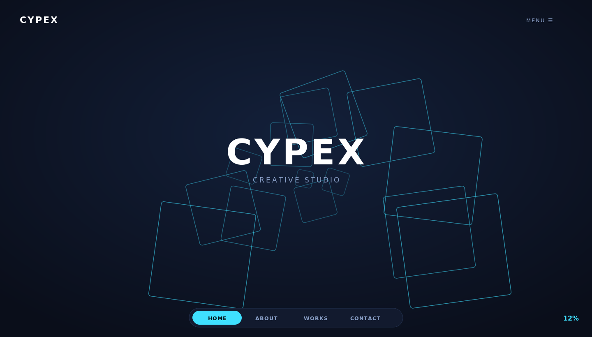
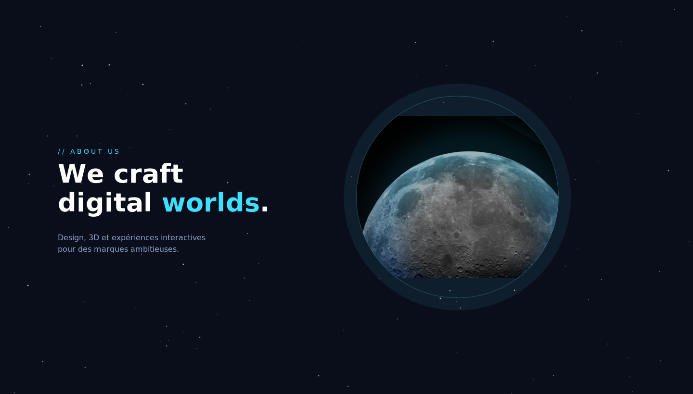
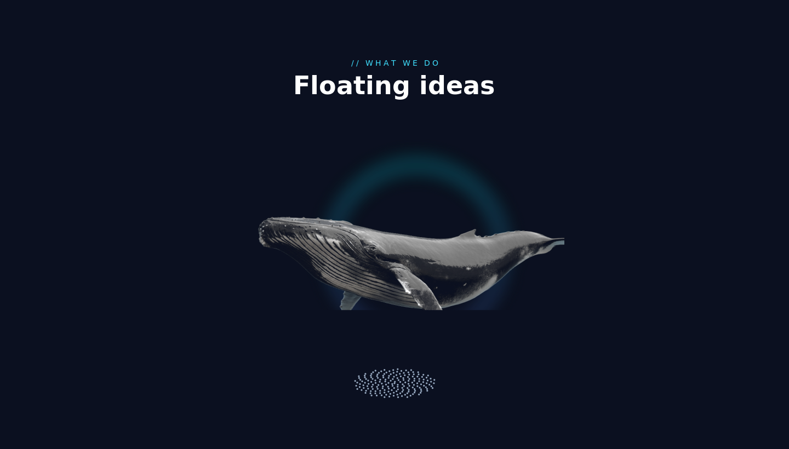

# Cypex — Site vitrine d'agence créative

Site **one-page** très animé pour une agence créative, réalisé **100% en HTML / CSS / JavaScript vanilla** (sans framework). Réalisé pendant le stage **ShipEx** (Technopark Casablanca).

> Projet de Badr Chigar — Ingénieur d'État en Informatique (EMSI Casablanca).

## Captures d'écran

### Accueil — vol immersif à travers les blocs


### About — planète 3D temps réel (Three.js)


### Sections animées


## Fonctionnalités & animations
- **Vol immersif** à travers des blocs en perspective (projection 3D maison en JavaScript) sur la page d'accueil.
- **Planète 3D en temps réel** rendue avec **Three.js** (texture blue-marble, rotation continue).
- **Pissenlit interactif** : nuage de particules (Canvas) qui se disperse au survol.
- **Baleine flottante** en image découpée animée.
- **Navigation animée** : barre inférieure avec pastille glissante et pourcentage de défilement.
- **Défilement section par section** (scroll-snap), préchargeur avec compteur, menu plein écran.

## Stack
| Élément | Détail |
|---------|--------|
| Langages | HTML5, CSS3, JavaScript (vanilla) |
| 3D | Three.js (CDN) |
| Animation | Canvas, requestAnimationFrame, projection en perspective |
| Dépendances | Aucune (hors Three.js via CDN) |

## Lancer le site
Le projet est un fichier autonome : il suffit d'ouvrir `index.html` dans un navigateur moderne.
```bash
# ou via un petit serveur statique
npx serve .
```

## Fichiers
```
cypex/
├── index.html   tout le site (HTML + CSS + JS)
├── whale.png    illustration baleine (découpe)
└── moon.png     texture/visuel planète
```

## Licence
MIT © Badr Chigar
